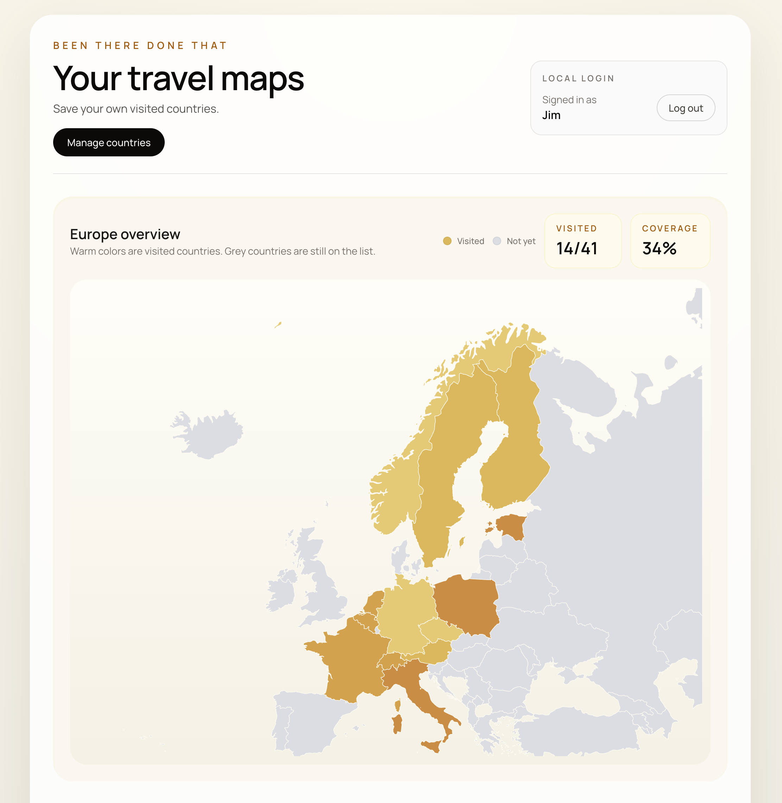

# Been There Done That

A personal travel map app for tracking countries you have visited across continents.

This project currently focuses on Europe and Asia, with an interactive map interface, local profile login, and browser-based persistence using `localStorage`.

## Screenshot



## What It Does

- Displays continent maps with `react-simple-maps`
- Highlights visited countries in a warm color palette
- Stores user-specific country selections in `localStorage`
- Uses a local profile name as a lightweight login
- Lets users manage visited countries from a modal editor

## Current Experience

When a user logs in locally, they can open the country manager modal, filter countries by continent, and toggle countries on or off.

- Checked country: saved immediately as visited
- Unchecked country: removed immediately
- No saved countries yet: all maps start at `0` visited

There is no backend yet. Everything is stored in the browser on the current device.

## Tech Stack

- Next.js 16
- React 19
- TypeScript
- Tailwind CSS 4
- `react-simple-maps`
- `react-modal`
- `world-atlas`

## Getting Started

Install dependencies:

```bash
npm install
```

Run the development server:

```bash
npm run dev
```

Open [http://localhost:3000](http://localhost:3000).

## Scripts

```bash
npm run dev
npm run build
npm run start
npm run lint
```

## Project Structure

```text
app/
  components/
    world-travel-map.tsx
    world-travel-map-data.ts
  globals.css
  layout.tsx
  page.tsx
```

- `app/components/world-travel-map.tsx`
  Main UI, modal editor, local-storage logic, and map rendering
- `app/components/world-travel-map-data.ts`
  Continent data, country lists, and map projection config
- `app/globals.css`
  Global styling plus modal overlay behavior

## Vision

The long-term vision is to turn this into a polished personal travel atlas:

- one place to track where you have been
- a visual, continent-first way to reflect your travel history
- a lightweight product that feels personal, fast, and easy to maintain

The app should stay simple for casual users while leaving room for richer travel storytelling over time.

## Roadmap

### Near Term

- Add more continents
- Improve map labeling and hover details
- Show visited counts globally, not just per continent
- Support mobile-first editing flows more cleanly

### Mid Term

- Add trip categories like `visited`, `lived`, and `wishlist`
- Add notes, dates, and trip memories per country
- Let users export and import their travel data
- Integrate Firebase Authentication for real sign-in
- Sync user travel data with Firebase so it works across devices

### Long Term

- Build a full cloud-backed profile system on top of Firebase
- Add shareable public travel profiles
- Generate visual summaries and travel statistics

## Notes

- User data is currently stored only in browser `localStorage`
- Clearing browser storage will remove saved countries
- `react-simple-maps` is installed in a React 19 app with peer-dependency override behavior enabled in this repo

## Attribution

Made by Jim and OpenAI Codex with ❤️.
